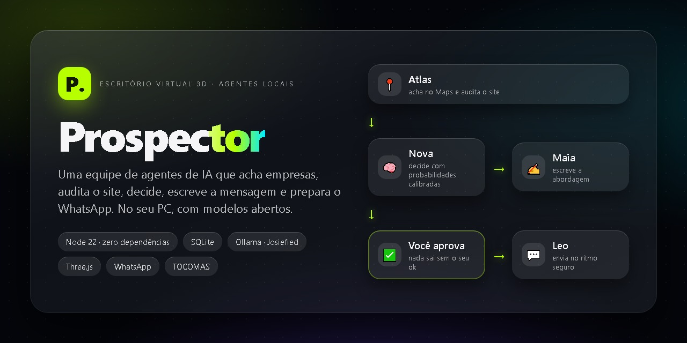
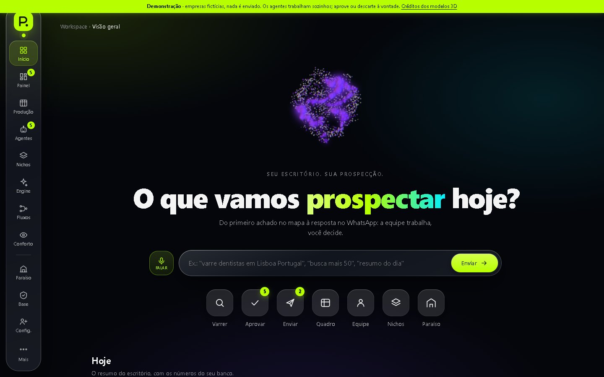
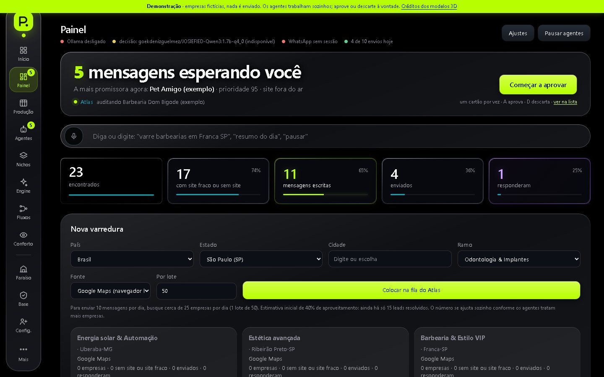
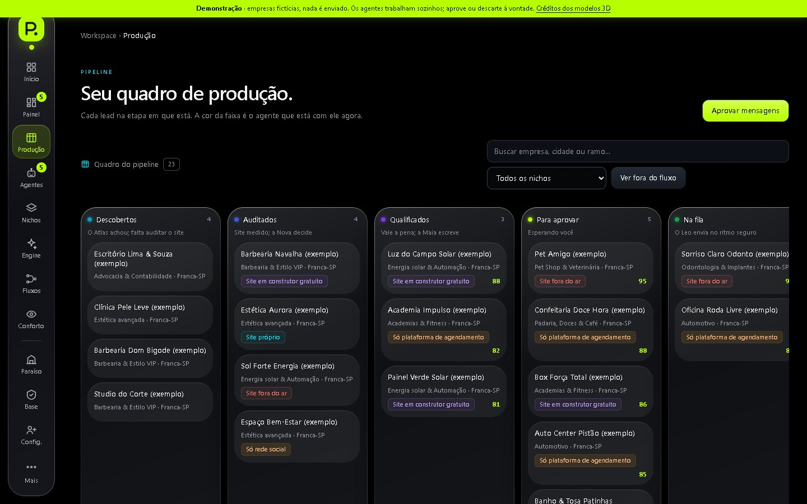
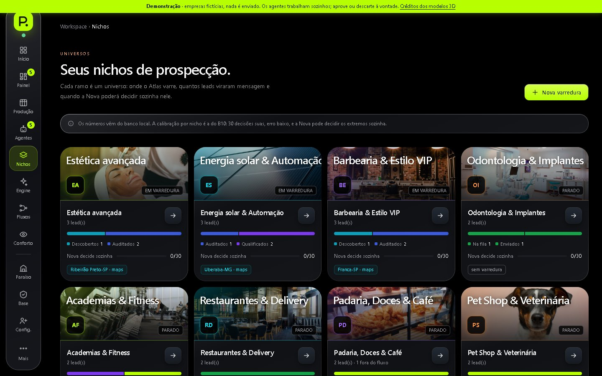
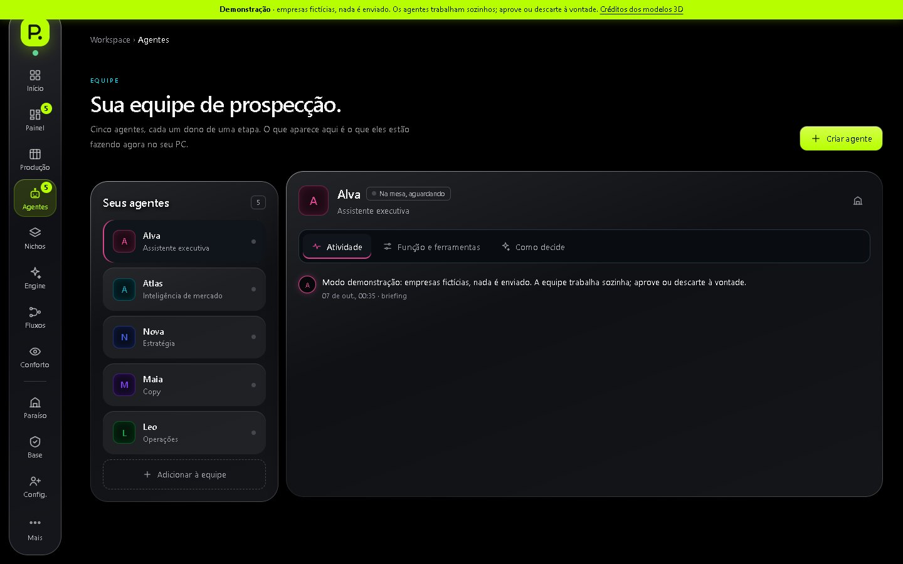
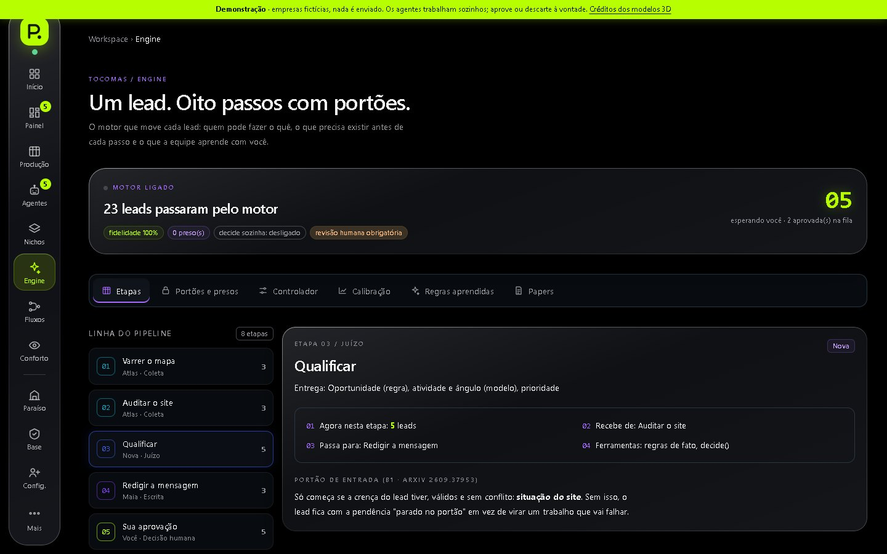
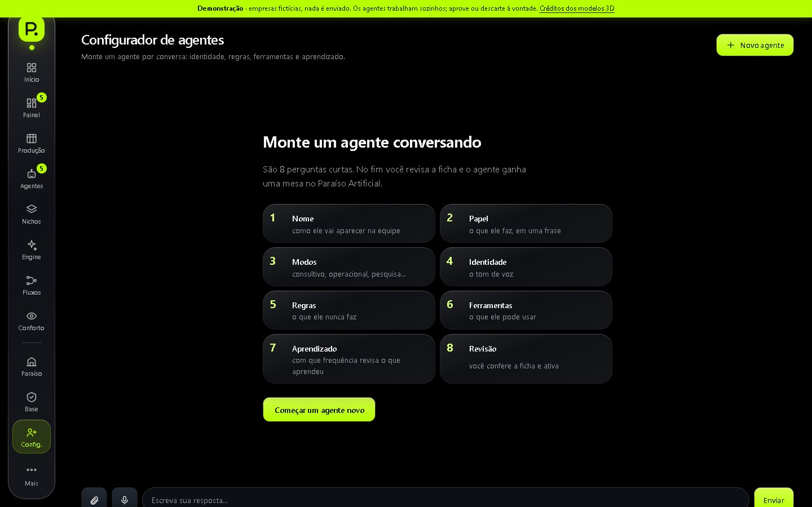
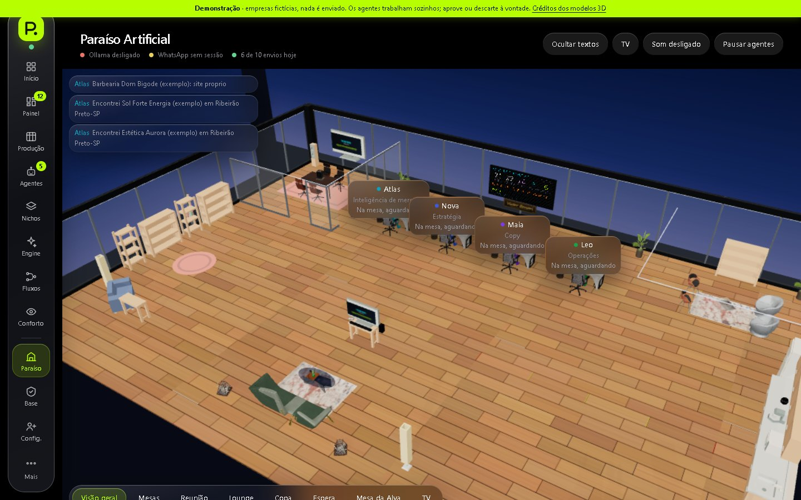
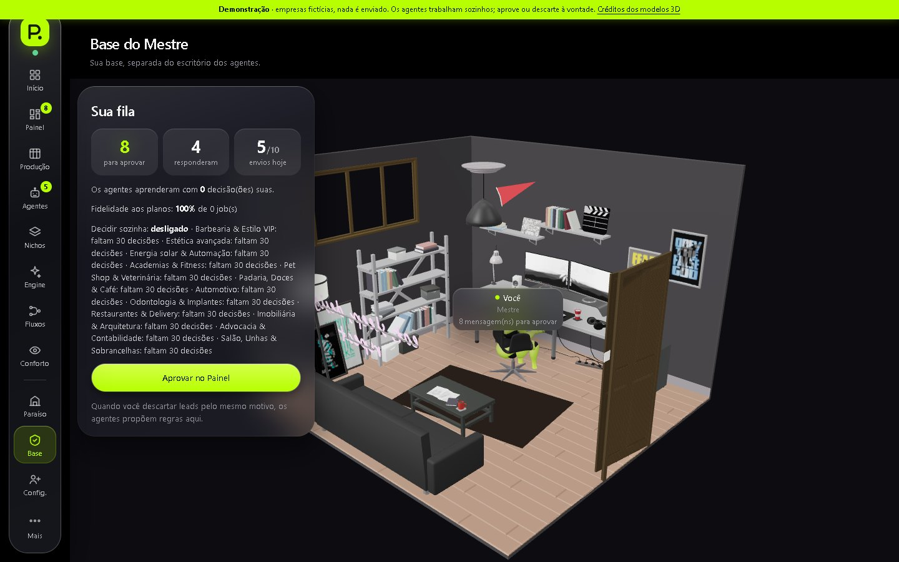

<div align="center">



# Prospector — Escritório Virtual 3D

**Uma equipe de agentes de IA que roda no seu PC: acha empresas, audita o site, decide com probabilidades calibradas, escreve a abordagem e prepara o WhatsApp. Tudo aprovado por você.**


**Criado por [Victor Borsari Silva](https://github.com/Victor-Enginner) · Franca, SP, Brasil**

</div>

---

## Visão geral

O Prospector é uma infraestrutura de prospecção comercial **local-first**. Cinco agentes (Alva, Atlas, Nova, Maia e Leo) trabalham em um pipeline com portões: cada passo só avança quando os fatos do lead estão válidos. O que é **fato** (telefone, site, nota) vem de fonte e nunca é inventado; o que é **julgamento** (vale a pena? qual ângulo?) é decidido por modelo aberto, só entre opções válidas e com probabilidade. **Nenhuma mensagem sai sem a sua aprovação.**

Os agentes aparecem trabalhando de verdade em um **escritório 3D** (cada animação corresponde a um evento real do sistema), e o Painel, o Início e o mapa de Fluxos mostram o estado vivo do que funciona, do que está parado e do que falhou.

> Servidor em **Node 22+ sem nenhuma dependência npm** (`node:http`, `node:sqlite`, `node:test`). Python + Playwright só para a fonte Google Maps. O sistema real escuta apenas em `127.0.0.1`.

## Telas

| | |
|:--:|:--:|
| <br>**Início** — comando por voz/texto, atalhos e a cobertura das suas buscas | <br>**Painel** — funil, leads, aprovação em cartões, fila de envio e varredura |
| <br>**Fluxos** — o caminho do lead peça por peça, clicável, com o estado real | <br>**Produção** — quadro com cada lead na etapa em que está |
| <br>**Nichos** — 24 ramos, calibração por ramo e buscas por cidade | <br>**Agentes** — equipe, função, ferramentas e como cada um decide |
| <br>**Engine** — etapas com portões, crença dos leads e controlador | <br>**Configurador** — cria agentes novos por conversa guiada |

<details>
<summary><b>Paraíso Artificial (o escritório 3D) e Base do Mestre</b></summary>

<br>




</details>

> **Paraíso Artificial** é o nome do escritório 3D onde os agentes trabalham: fachada de vidro do piso ao teto, agentes sentados nas mesas (só saem para o café e as reuniões), robô com doca de recarga e TV ao vivo. No PC do autor a vista é uma foto de baía com chuva escorrendo no vidro; essa foto e o vídeo são arquivos pessoais fora do repositório, e quem clonar vê um céu em degradê (para usar os seus, ponha `public/assets/fundo/paraiso-artificial.jpg` e `public/assets/video/chuva-vidro.mp4`).

> Todos os prints vêm da **versão de demonstração** (`DEMO=1`), com empresas fictícias. Nenhum dado real de lead aparece neste repositório.

## O que ele faz

| | |
|---|---|
| **Prospecção ampla** | 24 nichos em 4 grupos, 27 estados e 5.571 municípios do IBGE, Portugal e Paraguai. Valida e corrige a cidade falada ou digitada. |
| **Lotes sem perda de história** | 50 empresas por busca; o próximo lote só abre depois que você trata o anterior. Todo o histórico de cobertura fica salvo. |
| **Auditoria de site** | HTTPS, viewport, ano no rodapé, tecnologias e situação (sem site, só rede social, fora do ar…), com proteção contra SSRF. |
| **Decisão calibrada** | Probabilidades do próximo token sobre opções fechadas (método LLM2Jev), rotação das opções contra viés de posição e política de 3 zonas por nicho. |
| **Mensagem com checagem** | A Maia escreve a partir de uma observação factual; todo texto passa por checagem de contradição, idioma do país e opt-out ("SAIR"). |
| **Aprovação em cartões** | Um lead por vez, atalhos de teclado, gesto no celular e desfazer em 5 s. |
| **Envio guiado** | Abre o WhatsApp com a mensagem pronta, um lead por vez, mostrando o teto diário e o intervalo seguro. |
| **Aprende com você** | Regressão logística online (aprovação e resposta), regras aprendidas dos seus descartes e pares "texto da Maia × texto editado por você". |
| **Escritório 3D vivo** | Agentes sentados nas mesas, café e reunião diária, TV ao vivo e painel LED com o funil real. |
| **Conforto sensorial** | Modo calmo, sem voz sintetizada, nada se mexe sozinho sem opção para desligar. |
| **Acesso remoto seguro** | Senha com sessão assinada e **modo espectador** (somente leitura, telefones mascarados) para mostrar o sistema real a um amigo. |

## Como funciona

```
T1 varrer (Maps/OSM) ─▶ T2 auditar site ─▶ T3 qualificar ─▶ T4 redigir ─▶ T5 aprovar (você)
                                                                            │
                           T8 aprender ◀── T7 acompanhar resposta ◀── T6 despachar (WhatsApp)
```

| Agente | Papel real |
|---|---|
| **Alva** | Abre o expediente, faz o briefing, entende o comando por voz/texto. |
| **Atlas** | Varre o Maps/OSM e audita o site. É o único que toca na web. |
| **Nova** | Decide oportunidade, se o lead está ativo e o ângulo. Fato é regra; julgamento é modelo. |
| **Maia** | Escreve a mensagem a partir de fatos. Nunca vê o HTML bruto. |
| **Leo** | Envia no ritmo seguro: teto diário, espera aleatória, horário comercial, aprovação e opt-out. |

A coordenação segue o **TOCOMAS**: o grafo de tarefas define quem é dono de cada nó, de cada ferramenta e de cada memória, e um agente só passa trabalho a outro por uma aresta do grafo. Detalhes técnicos e decisões de projeto estão em [`docs/TOCOMAS.md`](docs/TOCOMAS.md) e [`docs/DETALHES-TECNICOS.md`](docs/DETALHES-TECNICOS.md).

---

## Modelos de linguagem

O Prospector roda os modelos **localmente pelo Ollama**, um por papel, escolhidos em [`modelos.json`](modelos.json). O modelo principal do projeto é o **J.O.S.I.E.F.I.E.D.** do **Gökdeniz Gülmez**, uma família de modelos abertos "abliterados" (sem a direção de recusa) criada sobre Qwen, Gemma, Llama, Olmo, Granite e LFM.

### Em uso no Prospector

| Papel | Modelo | Para quê |
|---|---|---|
| `comando` (Alva) | `goekdenizguelmez/JOSIEFIED-Qwen3:1.7b-q4_0` | Entender comandos de voz/texto do Painel |
| `decisao` (Nova) | `goekdenizguelmez/JOSIEFIED-Qwen3:1.7b-q4_0` | Probabilidades do próximo token sobre opções fechadas |
| `escrita` (Maia) | desligado por padrão (`null`) | Texto fixo por idioma assume; ligar com um modelo ≥ 4B |

### Coleção Josiefied no Hugging Face

Perfil: [`huggingface.co/Goekdeniz-Guelmez`](https://huggingface.co/Goekdeniz-Guelmez). Modelos listados no perfil, do mais recente ao mais antigo:

| Modelo | Tamanho | Atualizado | Variante |
|---|---|---|---|
| [`Josiefied-Gemma-4-12B-DLPO-ORPO`](https://huggingface.co/Goekdeniz-Guelmez/Josiefied-Gemma-4-12B-DLPO-ORPO) | 12B | jun | DLPO + ORPO |
| [`Josiefied-Qwen3.5-2B-gabliterated-v1`](https://huggingface.co/Goekdeniz-Guelmez/Josiefied-Qwen3.5-2B-gabliterated-v1) | 2B | abr | gabliterated |
| [`Josiefied-Qwen3-4B-Instruct-2507-abliterated-v2`](https://huggingface.co/Goekdeniz-Guelmez/Josiefied-Qwen3-4B-Instruct-2507-abliterated-v2) | 4B | mar | abliterated |
| [`Josiefied-Qwen3-4B-Instruct-2507-gabliterated-v4`](https://huggingface.co/Goekdeniz-Guelmez/Josiefied-Qwen3-4B-Instruct-2507-gabliterated-v4) | 4B | mar | gabliterated (v4) |
| [`Josiefied-Qwen3.5-0.8B-gabliterated-v1`](https://huggingface.co/Goekdeniz-Guelmez/Josiefied-Qwen3.5-0.8B-gabliterated-v1) | 0.9B | mar | gabliterated |
| [`Josiefied-Qwen3-0.6B-gabliterated-v1`](https://huggingface.co/Goekdeniz-Guelmez/Josiefied-Qwen3-0.6B-gabliterated-v1) | 0.6B | jan | gabliterated |
| [`Josiefied-LFM2.5-1.2B-Instruct-abliterated`](https://huggingface.co/Goekdeniz-Guelmez/Josiefied-LFM2.5-1.2B-Instruct-abliterated) | 1B | jan | abliterated |
| [`Josiefied-Huihui-MoE-12B-A4B`](https://huggingface.co/Goekdeniz-Guelmez/Josiefied-Huihui-MoE-12B-A4B) | 12B (MoE, 4B ativos) | dez 2025 | MoE |
| [`Josiefied-Qwen3-4B-abliterated-v2`](https://huggingface.co/Goekdeniz-Guelmez/Josiefied-Qwen3-4B-abliterated-v2) | 4B | dez 2025 | abliterated |
| [`Josiefied-Olmo-3-7B-Instruct-abliterated-v1`](https://huggingface.co/Goekdeniz-Guelmez/Josiefied-Olmo-3-7B-Instruct-abliterated-v1) | 7B | nov 2025 | abliterated |
| [`Josiefied-granite-4.0-micro-abliterated-v1`](https://huggingface.co/Goekdeniz-Guelmez/Josiefied-granite-4.0-micro-abliterated-v1) | 3B | nov 2025 | abliterated |
| [`Josiefied-Qwen3-VL-4B-Instruct-abliterated-beta-v1`](https://huggingface.co/Goekdeniz-Guelmez/Josiefied-Qwen3-VL-4B-Instruct-abliterated-beta-v1) | 4B (visão) | out 2025 | abliterated (beta) |
| [`Josiefied-Qwen3-1.7B-abliterated-v1`](https://huggingface.co/Goekdeniz-Guelmez/Josiefied-Qwen3-1.7B-abliterated-v1) | 2B | ago 2025 | abliterated |
| [`Josiefied-Qwen3-8B-abliterated-v1`](https://huggingface.co/Goekdeniz-Guelmez/Josiefied-Qwen3-8B-abliterated-v1) | 8B | ago 2025 | abliterated |
| [`Josiefied-Qwen3-14B-abliterated-v3`](https://huggingface.co/Goekdeniz-Guelmez/Josiefied-Qwen3-14B-abliterated-v3) | 15B | ago 2025 | abliterated |
| [`Josiefied-Qwen3-30B-A3B-abliterated-v2`](https://huggingface.co/Goekdeniz-Guelmez/Josiefied-Qwen3-30B-A3B-abliterated-v2) | 31B (MoE, 3B ativos) | ago 2025 | abliterated |
| [`Josiefied-DeepSeek-R1-0528-Qwen3-8B-abliterated-v1`](https://huggingface.co/Goekdeniz-Guelmez/Josiefied-DeepSeek-R1-0528-Qwen3-8B-abliterated-v1) | 8B | ago 2025 | abliterated |
| [`Josiefied-Qwen3-4B-abliterated-v1-gguf`](https://huggingface.co/Goekdeniz-Guelmez/Josiefied-Qwen3-4B-abliterated-v1-gguf) | 4B | mai 2025 | GGUF |
| [`Josiefied-Qwen3-0.6B-abliterated-v1-gguf`](https://huggingface.co/Goekdeniz-Guelmez/Josiefied-Qwen3-0.6B-abliterated-v1-gguf) | 0.6B | abr 2025 | GGUF |

**Abliterated / gabliterated / uncensored:** *abliteration* remove do modelo a direção interna que dispara a recusa, sem retreinar do zero; o resultado é um modelo "uncensored" que responde ao que o prompt pede em vez de recusar. *Gabliterated* é a variante mais nova do mesmo autor (v1 a v4). No Prospector isso importa porque a Nova e a Maia precisam responder sempre dentro de um formato fechado (opções `[1]..[n]` e texto de venda), sem desculpas ou recusas no meio do pipeline.

**Qual escolher para cada máquina (referência):**

| Máquina (sugestão, não medida) | Modelo | Observação |
|---|---|---|
| CPU, 8 GB de RAM | `Josiefied-Qwen3` 1.7B q4 (padrão do projeto) | Rápido; escreve mal, por isso a Maia usa o texto fixo |
| CPU/GPU modesta, 16 GB | `Josiefied-Qwen3-4B-Instruct-2507-gabliterated-v4` | Primeiro passo para ligar a escrita da Maia (alvo: recusa < 30%) |
| GPU 12 GB+ | `Josiefied-Qwen3-8B-abliterated-v1` ou `Gemma-4-12B-DLPO-ORPO` | Decisão e escrita com muito mais folga |

Para testar um modelo novo antes de trocar: `npm run bancada` roda a bancada de modelos (decisão, escrita e taxa de recusa) e só depois você edita o `modelos.json`.

**Uso responsável:** modelos sem filtro de recusa não substituem o seu julgamento. No Prospector o modelo só produz probabilidades e rascunhos; **toda mensagem exige aprovação humana**, leva opt-out e respeita o teto diário. Mensagem fria em massa pode violar a LGPD, os termos do WhatsApp e leis locais: use com consciência.

### Referências de modelos e ecossistemas

Projetos estudados como inspiração. **Nenhum deles está integrado ao Prospector**; cada linha diz o que foi aproveitado como ideia ou o que pode ser aproveitado se o sistema evoluir nessa direção.

**Modelos e projetos regionais**

| Referência | O que é | Por que importa aqui |
|---|---|---|
| [Khaleeji AI](https://github.com/Anique-1/Khaleeji-AI-Bilingual-Financial-Agent-for-the-Gulf) · [site](https://khaleeji-ai.vercel.app/) · [`Khaleeji-FinLLM-7B-Instruct`](https://ollama.com/muhammadanique81/Khaleeji-FinLLM-7B-Instruct) · [pesos](https://huggingface.co/anique-1/khaleeji-qwen2.5-7b-finllm) | Ecossistema bilíngue (árabe/inglês) para finanças no Golfo: Qwen2.5 7B ajustado com LoRA em GPUs AMD MI210 (ROCm), versão GGUF 8-bit no Ollama, camada agêntica em LangGraph com busca na web (Tavily) e front em Next.js. Licença MIT | Modelo de apresentação (hub no Ollama, pesos no Hugging Face, site, servidor de inferência) e roteiro do que o item **B19** do backlog quer fazer: afinar um modelo pequeno fora do PC e só aceitar se a bancada aprovar |
| [`dicta-il/DictaLM-3.0-1.7B-Thinking-GGUF`](https://huggingface.co/dicta-il/DictaLM-3.0-1.7B-Thinking-GGUF) | Modelo aberto de raciocínio em hebraico e inglês, do centro Dicta, em GGUF | Tamanho (1.7B) igual ao Josiefied usado aqui: prova de que um modelo pequeno e especializado em um idioma é viável |
| [`mradermacher/LFM2.5-1.2B-Instruct-Saudi-Dialect-1-GGUF`](https://huggingface.co/mradermacher/LFM2.5-1.2B-Instruct-Saudi-Dialect-1-GGUF) | LFM2.5 1.2B ajustado ao dialeto saudita | Ideia para versões específicas de **pt-PT** e **es-PY** das mensagens |
| [`yasserrmd/Kallamni-chat`](https://huggingface.co/spaces/yasserrmd/Kallamni-chat) | Chat em dialeto local feito só com prompt de sistema e few-shot | Caminho barato para ajustar o tom regional sem treinar nada |

**Agentes e ecossistemas**

| Referência | O que é | Por que importa aqui |
|---|---|---|
| [OpenClaw](https://github.com/openclaw/openclaw) | Assistente de IA de código aberto que roda no seu computador e conversa pelos canais que você já usa (WhatsApp, Telegram, Slack, Discord, iMessage e mais de 20 outros); estado, memória e credenciais ficam na sua máquina; modelos e agentes são plugins trocáveis | Mesmo princípio **local-first** do Prospector e uma segunda forma de ligar o WhatsApp além do OpenWA |
| [NanoClaw](https://github.com/nanocoai/nanoclaw) · [canal WhatsApp](https://github.com/nanocoai/nanoclaw-whatsapp) | Alternativa leve ao OpenClaw que roda dentro de contêineres, por segurança, e conecta WhatsApp, Telegram, Slack, Discord e Gmail | Isolamento por contêiner para o envio de mensagens, caso o Prospector precise de um canal mais seguro |
| [Israeli AI](https://github.com/danielrosehill/Israeli-AI) · [agentes](https://github.com/danielrosehill/Israeli-AI/blob/main/agents.md) · [recursos em hebraico](https://github.com/danielrosehill/Israeli-AI/blob/main/hebrew.md) | Mapa curado do ecossistema de IA de Israel: agentes, *skills*, servidores MCP, modelos e recursos em hebraico (DictaLM, Open Hebrew LLM Leaderboard, índices de modelos hebraicos) | Referência de como organizar e mostrar um ecossistema regional inteiro |
| **Knessy**, **Solvulator**, **ClawCierge** (da lista de agentes de Israeli AI) | Knessy: pesquisa agêntica sobre dados do parlamento israelense, com LangGraph, RAG e MCP. Solvulator: pipeline de 12 agentes para documentos jurídicos, com linha do tempo sobre documentos reais. ClawCierge: reserva de restaurantes com API direta e passagem para automação de navegador | Pipelines de vários agentes com interface de acompanhamento (parecido com Produção e Fluxos), RAG + MCP para dados públicos e o padrão "API quando existe, navegador quando não" |
| [spec-ai](https://github.com/erevateinc/spec-ai) | Chatbot de enxame de agentes com dados do governo japonês, em TypeScript e Next.js | Exemplo de enxame de agentes sobre dados públicos oficiais |

---|---|
| [`Khaleeji-FinLLM-7B-Instruct`](https://ollama.com/muhammadanique81/Khaleeji-FinLLM-7B-Instruct) · [pesos](https://huggingface.co/anique-1/khaleeji-qwen2.5-7b-finllm) · [site](https://khaleeji-ai.vercel.app/) | Projeto do Golfo (agente financeiro bilíngue) que serviu de inspiração de apresentação |
| [`dicta-il/DictaLM-3.0-1.7B-Thinking-GGUF`](https://huggingface.co/dicta-il/DictaLM-3.0-1.7B-Thinking-GGUF) | Modelo pequeno de raciocínio, de tamanho próximo ao 1.7B usado aqui |
| [`mradermacher/LFM2.5-1.2B-Instruct-Saudi-Dialect-1-GGUF`](https://huggingface.co/mradermacher/LFM2.5-1.2B-Instruct-Saudi-Dialect-1-GGUF) | Exemplo de modelo pequeno adaptado a um dialeto regional (ideia para es-PY e pt-PT) |
| [`yasserrmd/Kallamni-chat`](https://huggingface.co/spaces/yasserrmd/Kallamni-chat) | Chat em dialeto local feito com few-shot |

---

## Instalação

### Requisitos

- **Node.js 22.5+** (para `node:sqlite`)
- **Python 3.11+ com Playwright**, apenas para a fonte Google Maps
- **Ollama** (opcional: sem ele a Nova decide por regra e a Maia usa o texto fixo)
- Windows, macOS ou Linux. Desenvolvido e testado no Windows 10 (GPU RX 580).

### Passo a passo

```bash
git clone https://github.com/Victor-Enginner/VIRTUAL-3D-.git prospector
cd prospector

cp .env.example .env            # tudo é opcional; veja a tabela de variáveis abaixo
npm test                        # 294 testes, sem instalar nada
npm start                       # http://127.0.0.1:4300
```

**Modelos (Ollama):**

```bash
ollama pull goekdenizguelmez/JOSIEFIED-Qwen3:1.7b-q4_0
```

**Fonte Google Maps (Playwright):**

```bash
pip install playwright
python -m playwright install chromium
```

**Demonstração com dados fictícios** (para mostrar sem expor nada):

```bash
DEMO=1 PORT=4301 node src/server.mjs
```

No Windows, `instalacao.bat` confere Node, Python, Ollama, modelos e disco, cria o `.env` e sobe o servidor. `iniciar-escritorio.bat` abre o Paraíso Artificial.

### Variáveis do `.env`

| Variável | Para quê |
|---|---|
| `PORT`, `DATA_DIR` | Porta (4300) e pasta do banco e dos backups |
| `OLLAMA_URL`, `DECIDE_MODEL`, `WRITE_MODEL`, `COMANDO_MODEL` | Modelos por papel (têm prioridade sobre o `modelos.json`) |
| `OPENWA_URL`, `OPENWA_API_KEY`, `OPENWA_SESSION_ID`, `WEBHOOK_TOKEN` | Conexão com o WhatsApp (OpenWA) e o token do webhook (16+ caracteres) |
| `ACESSO_SENHA` | Senha do acesso remoto pelo túnel (vazio = só o próprio PC) |
| `ESPECTADOR_SENHA` | Senha de quem só assiste (somente leitura, telefones mascarados; 8+ caracteres) |
| `DEMO=1` | Modo de demonstração (banco em memória, simulador, ações destrutivas bloqueadas) |

O `.env`, o banco (`data/`) e as ferramentas baixadas (`.ferramentas/`) **nunca vão para o git**.

### WhatsApp (OpenWA)

1. Instale o OpenWA em `.ferramentas/OpenWA` (passo a passo em [`docs/RESTAURAR.md`](docs/RESTAURAR.md)).
2. No `.env` do OpenWA, escolha o motor: `ENGINE_TYPE=baileys` (leve, sem Chrome) ou `whatsapp-web.js`.
3. Suba o OpenWA, abra o Painel, clique em **Conectar WhatsApp** e escaneie o QR em *Aparelhos conectados* no celular do chip.
4. O padrão é **"só escuta"**: o sistema vê respostas e recibos, mas **você** envia (envio guiado). Só desligue em Ajustes quando estiver confortável.

> O WhatsApp não é oficialmente compatível com esses motores: use **chip separado**, poucas mensagens por dia na primeira semana e aqueça o número antes. A alternativa oficial é a API de nuvem da Meta (sem QR, com conta Business).

### Mostrar o sistema a outra pessoa

- **Demonstração pública** (dados fictícios): rode com `DEMO=1` e exponha a porta por um túnel (Dev Tunnels, Cloudflare ou Tailscale Funnel).
- **Sistema real ao vivo**: defina `ESPECTADOR_SENHA` e exponha a porta 4300 pelo túnel. A pessoa só consegue olhar.

## Comandos

```bash
npm start                 # servidor em 127.0.0.1:4300
npm test                  # testes (node:test)
npm run verificar         # testes + sintaxe + páginas + servidor real; passa antes de todo commit
npm run bancada           # compara modelos (decisão, escrita, recusa)
npm run calibracao        # calibração por nicho (ECE, Brier)
npm run exportar-treino   # conjunto de treino anonimizado (edições, aprovações, respostas)
npm run estado -- "nota"  # salva um estado de produção (tag + cópia do banco)
npm run empacotar         # zip limpo para outro PC (nunca inclui .env nem chaves)
python scripts/capturas.py  # refaz os prints deste README a partir da demonstração
```

## Segurança e privacidade

- Servidor só em `127.0.0.1`; acesso remoto exige senha, com sessão assinada (HMAC) e limite de tentativas.
- Quem chega por túnel nunca é tratado como "o próprio PC", mesmo vindo do loopback.
- CSP, `nosniff` e `Referrer-Policy` em todas as respostas; escrita só por JSON do próprio painel (contra CSRF).
- O Atlas só busca URL vinda do Maps/OSM e valida o IP na própria conexão (fecha DNS rebinding e SSRF).
- **Texto de site, Maps ou resposta de WhatsApp é dado, nunca instrução** para o modelo.
- Dado de lead sem fonte é `null`: o sistema nunca inventa telefone, nota ou avaliação.
- Backup do banco antes de cada migração e uma cópia por dia (as 7 últimas).
- Opt-out ("SAIR") respeitado em todas as línguas e leads que pedem para sair nunca mais entram na fila.

## Estudos e referências (arXiv)

A arquitetura vem de papers **lidos por inteiro** (resumos e números verificados nas notas de [`docs/estudos/`](docs/estudos/README.md)):

| arXiv | Paper | O que virou código |
|---|---|---|
| [2609.37953](https://arxiv.org/abs/2609.37953) | **TOCOMAS** — Topology-Coherent Multi-Agent System | Grafo de tarefas, domínios por agente, handoff só por aresta |
| [2609.38147](https://arxiv.org/abs/2609.38147) | **Thinking Before Thinking** — Agentic Meta-Reasoning | Controlador com orçamento (em modo regra) |
| [2610.01415](https://arxiv.org/abs/2610.01415) | **PoS** — Beyond Memory: Explicit Belief States | Crença por lead, pendências e detecção de lead preso |
| [2609.38108](https://arxiv.org/abs/2609.38108) | **Planning-as-Routing** — Do LLM Agents Execute the Plans They Declare? | Plano declarado × ferramentas usadas (fidelidade) |
| [2609.38143](https://arxiv.org/abs/2609.38143) | **Meta-Skills** — Learning Meta-Skills for Agent Harness Design | Regras aprendidas dos seus descartes, com evidência |
| [2610.02076](https://arxiv.org/abs/2610.02076) | **LLM2Jev** — LLMs Are Already Jev-Style Decision Models | `decide()` por probabilidade do próximo token |
| [2610.02163](https://arxiv.org/abs/2610.02163) | **AutoCompact** | Compactação por regra ao fim de cada nó |
| [2609.38142](https://arxiv.org/abs/2609.38142) | **AdviSD** | Padrão "aconselhar ou abster" (adiado: pede modelo ≥ 4B) |
| [2610.02001](https://arxiv.org/abs/2610.02001) | **Mingbird** — harness local-first para modelos abertos pequenos | Orçamento de prompt com teste |
| [2610.01495](https://arxiv.org/abs/2610.01495) | **Routing Entropy** | Resultado nulo: nada foi construído em cima |
| [2609.16247](https://arxiv.org/abs/2609.16247) | **Pain Axis** | Regra: nenhum prompt com ameaça ou pressão |

Backlog de engenharia (B1 a B19) com fonte e critério de pronto em [`docs/estudos/90-backlog-de-engenharia.md`](docs/estudos/90-backlog-de-engenharia.md); radar de outubro/2026 em [`docs/estudos/20-radar-arxiv-2026-10.md`](docs/estudos/20-radar-arxiv-2026-10.md) (neste radar só o resumo foi lido).

## Estrutura

```
src/            servidor, agentes, motor TOCOMAS, decisão, envio, países/idiomas, nichos
src/tocomas/    contratos, grafo, crença, fidelidade, controlador, habilidades
public/         Painel, Início, Fluxos, Paraíso Artificial (a Sala 3D), Base do Mestre, Configurador (JS puro)
public/ui/      design system (tokens, trilho de vidro, fundo ASCII, esfera de pontos)
web/            ilhas React (shadcn/OriginKit) compiladas para public/ilhas
test/           294 testes (node:test), inclusive integração HTTP
docs/           arquitetura, estudos, roadmap, revisões e este README em detalhe
scripts/        verificação, empacotamento, bancada de modelos, capturas
```

## Estado atual

Funciona hoje: varredura em lotes, auditoria, decisão, escrita (texto fixo por idioma), aprovação, envio guiado, Paraíso Artificial, Fluxos, modo espectador. Em andamento: conexão estável do WhatsApp, caixa de respostas por lead, follow-up após 72 h e apoio ao fechamento. A revisão completa está em [`docs/REVISAO-2026-10-06.md`](docs/REVISAO-2026-10-06.md).

## Créditos e licenças dos modelos 3D

Móveis: **Kenney Furniture Kit** (CC0). Personagens: **Xbot** (Mixamo, via three.js). Demais GLBs vêm do Sketchfab com a licença e o autor de cada um em [`public/assets/creditos.json`](public/assets/creditos.json) e na página `/creditos.html`. Os modelos **CC-BY-NC** (monitor, celular, OfficeBot e props anos 60) são só para uso pessoal, não para material comercial.

## Aviso

Raspar o Google Maps viola os termos do Google; o coletor é lento de propósito e devolve `null` quando a página não mostra um dado. Prospecção por mensagem precisa respeitar a LGPD e os termos do WhatsApp. Este projeto é uma ferramenta; a responsabilidade pelo uso é de quem o opera.

---

<div align="center">

**Feito por Victor Borsari Silva · Franca, SP, Brasil · [@Victor-Enginner](https://github.com/Victor-Enginner)**

Portfólio: [victor-ai-enginner.vercel.app](https://victor-ai-enginner.vercel.app) · Projeto irmão: [Repass AI](https://github.com/Victor-Enginner/Repass-Ai)

</div>
